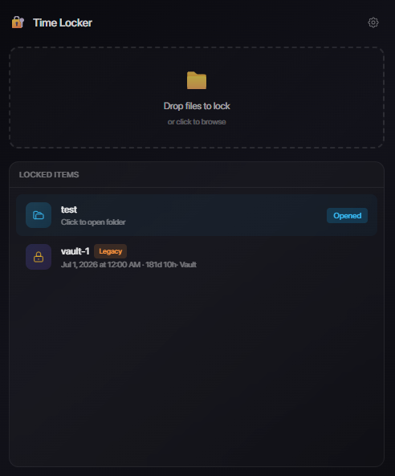

# Time Locker

A desktop application for time-locked file encryption. Files remain cryptographically locked until a specified unlock time, using blockchain-based randomness from [drand](https://drand.love/) to enforce temporal security.



## Features

- **Time-Lock Encryption** - Files cannot be decrypted before the specified time, regardless of password guessing or brute force attacks
- **Drag & Drop Interface** - Simply drop files or folders to lock them
- **Vault Management** - Organize locked items in multiple vault directories
- **Progress Tracking** - Real-time progress for lock/unlock operations

## How It Works

Time Locker uses [tlock](https://github.com/drand/tlock) encryption powered by the drand Quicknet beacon network. When you lock a file:

1. Your file is compressed into an encrypted 7z archive (AES-256, encrypted headers)
2. The archive key is time-locked using drand's threshold BLS signatures
3. The decryption key only becomes available when drand publishes the beacon for your specified round

This means **no one** - not even you - can decrypt the file before the unlock time.

## Installation

Download the latest release for your platform from the [Releases page](https://github.com/justmaier/time-locker/releases).

## Development

For contributors who want to build from source:

### Prerequisites

- [Node.js](https://nodejs.org/) (v18+)
- [Rust](https://rustup.rs/) (1.70+)

### Setup

```bash
# Install dependencies
npm install

# Run in development mode
npm run tauri dev

# Build for production
npm run tauri build
```

## Usage

### GUI Mode

1. Launch the application
2. Drag and drop files/folders onto the drop zone
3. Select an unlock date/time
4. Your files are locked in the vault

Locked items appear in the "LOCKED ITEMS" section with their unlock time displayed.

### CLI Mode

```bash
# Lock a file (unlocks on July 1, 2026)
timelocker lock --unlock-at "2026-07-01" --vault ./vault ./my-file.txt

# Lock with original file deletion
timelocker lock --unlock-at "2026-07-01" --vault ./vault --delete-original ./secret.txt

# Unlock a file (only works after unlock time)
timelocker unlock ./vault/my-file.7z.tlock --output ./recovered

# View lock metadata
timelocker info ./vault/my-file.7z.tlock

# List all locked items in a vault
timelocker list --vault ./vault

# Migrate legacy format
timelocker migrate ./vault/old-file.key.md --delete-old
```

## Tech Stack

- **Frontend**: Svelte + Vite + Tailwind CSS
- **Desktop**: Tauri (Rust)
- **Encryption**: tlock_age + AES-256-GCM + 7z archives
- **Time Source**: drand Quicknet beacon

## File Format

Locked files use the `.7z.tlock` extension containing:
- Time-locked encryption key
- AES-256 encrypted 7z archive with encrypted headers
- Metadata (unlock time, original filename)

## License

MIT
